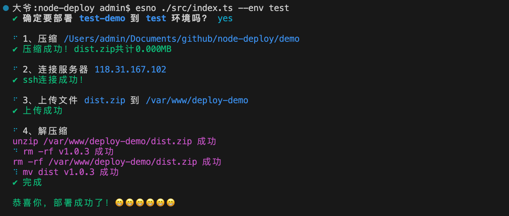

# node-deploy-cli

一个cli工具，用于部署代码到服务器。适用于小团队。

## 安装

```node
npm install node-deploy-cli --save-dev
```

## 使用

### 创建deploy.config.json

```node
npm deploy init
```

```json
{
  "name": "test-demo",
  "test": {
    "username": "root",
    "password": "123456",
    "host": "118.31.167.102",
    "localDir": "demo",
    "remoteDir": "/var/www/deploy-demo/"
  },
  "prod": {
    "username": "root",
    "password": "123456",
    "host": "118.31.167.102",
    "localDir": "demo",
    "remoteDir": "/var/www/deploy-demo/"
  }
}
```

### 部署

```node
npm deploy --env test
```



